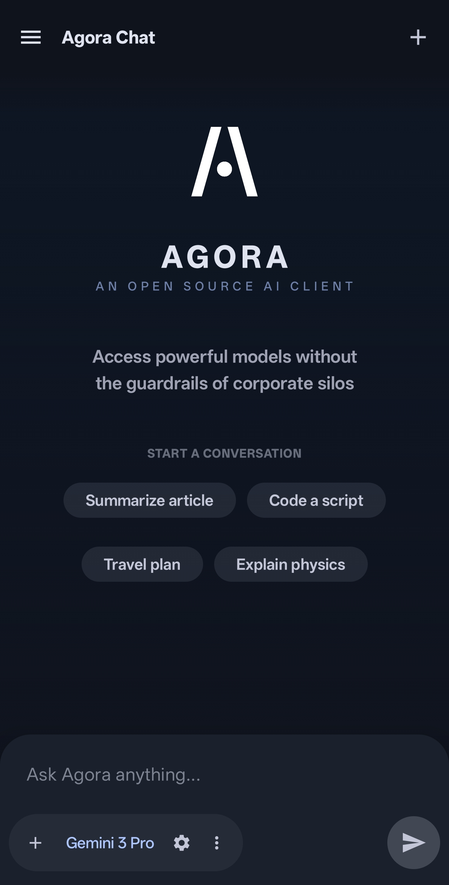

<div align="center">
  

  # Agora
  
  **Access powerful models without the guardrails of corporate silos.**

  [](https://opensource.org/licenses/MIT)
  [](https://developer.android.com)
  [](https://kotlinlang.org/)
</div>

---

Official LLM apps are often heavily restricted, wrapping capable AI models in sanitized, linear, and limited user interfaces. **Agora is different.** 

Agora is a completely open-source, BYOK (Bring Your Own Key) Android client designed for power users who want raw, unrestricted access to frontier models. Built natively with Jetpack Compose, it brings desktop-class agentic capabilities to your mobile device, emphasizing user control, privacy, and architectural flexibility.

## Why Agora?

- **No Middlemen:** You connect directly to the API provider. There are no intermediary servers, no hidden telemetry, and no corporate tracking logging your conversations. Your chat history lives locally on your device.
- **Non-Linear Thought:** Human conversation isn't a straight line, and AI interactions shouldn't be either. Agora uses a tree-structured database that allows you to edit past messages, regenerate responses, and seamlessly explore alternative conversation branches without losing your original context.
- **Agentic Workflows:** Native support for cutting-edge model capabilities. Agora explicitly supports **Thinking/Reasoning** models, **Code Execution**, and **Google Search** integration directly in the chat.

## Features

- **Bring Your Own Key (BYOK):** Unrestricted access. You control the API key, the model, the system prompts, and the parameters.
- **Branching History:** Navigate complex, multi-turn conversations with a robust parent-child message architecture.
- **Context Management:** Real-time token counting and a configurable sliding context window to optimize your API costs and model performance.
- **System Prompts:** Create, save, and switch between different system prompts (personas) on the fly.
- **Modern & Fluid UI:** A fully reactive, single-activity UI built entirely in Jetpack Compose. Features precise message anchoring, animated auto-scrolling during model streaming, and an immersive, gesture-driven image viewer.
- **Markdown & Syntax Highlighting:** Rich text rendering for code blocks, tables, and standard markdown formatting.

## Screenshots

<div align="center">
  
</div>

## Getting Started

### Prerequisites
- [Android Studio](https://developer.android.com/studio) (Ladybug or newer recommended)
- Android SDK 34+
- A valid Gemini API Key (or other supported provider)

### Installation

1. Clone the repository:
   ```bash
   git clone https://github.com/newo-ether/Agora.git
   ```
2. Open the project in Android Studio.
3. Sync the project with Gradle files.
4. Build and run the app on an emulator or a physical Android device.

### Configuration

1. Launch Agora on your device.
2. Open the **Settings** menu via the navigation drawer.
3. Add your **API Key** securely within the app.
4. Customize your experience by adjusting the active model, system prompts, and context limits.

## Tech Stack

Agora is built for performance and maintainability using modern Android architecture:
- **Language:** [Kotlin](https://kotlinlang.org/)
- **UI Framework:** [Jetpack Compose](https://developer.android.com/jetpack/compose) (Material 3)
- **Architecture:** MVVM (Model-View-ViewModel)
- **Concurrency:** Kotlin Coroutines & Flow
- **Local Storage:** [Room Database](https://developer.android.com/training/data-storage/room) (Tree-structured message schema) & DataStore
- **Networking:** Native `HttpURLConnection` with Server-Sent Events (SSE) support for streaming
- **Serialization:** `kotlinx.serialization`

## Contributing

Contributions are welcome! If you'd like to help improve Agora, please feel free to fork the repository, submit pull requests, or open an issue to discuss new features or bug fixes.

## License

This project is open-source and available under the [MIT License](LICENSE).
