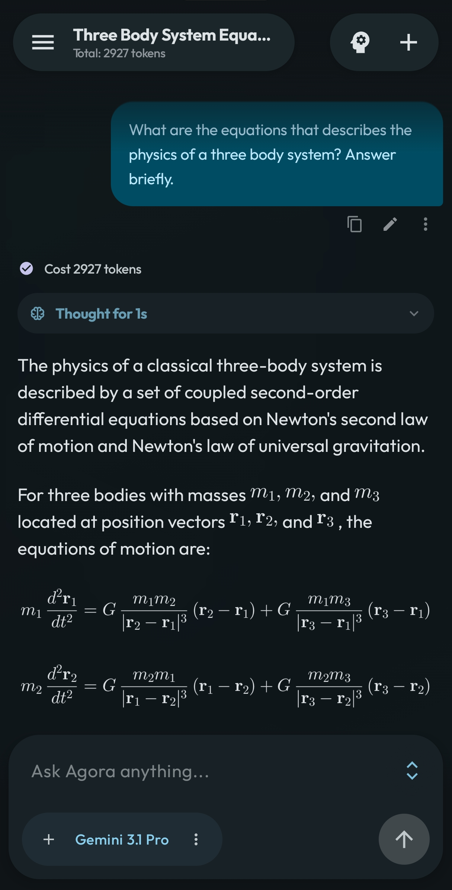
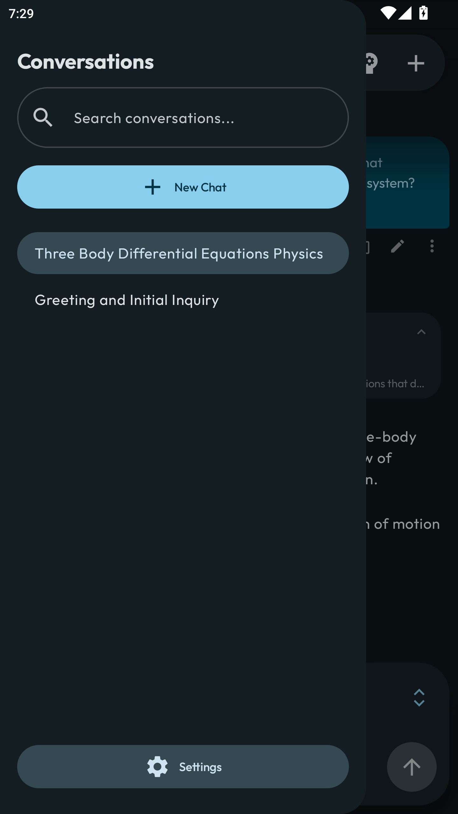
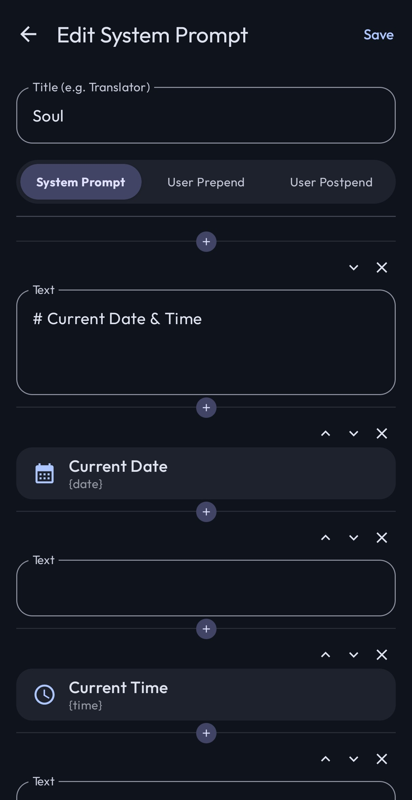

  

  # Agora
  
  **BYOK LLM 客户端 — 多平台接入、智能代理工作流、远程设备控制**

  
  
  

---

**Agora** — 为 AI 重度用户打造的 BYOK Android 客户端。接入 8+ 大模型平台，使用自己的 API 密钥，支持对话分支树、llama.cpp 本地推理、加密远程 Shell 控制。所有数据存储在本地，无日志泄露。开源，MIT 协议。

## 截图

<table>
<tr>
<td width="33%"></td>
<td width="33%"></td>
<td width="33%"></td>
</tr>
</table>

## 为什么选择 Agora？

- **无中间层：** 直连 API。无遥测、无追踪、无企业服务器记录你的对话。一切存储在本地 Room 数据库中。
- **非线性思维：** 树形消息数据库让你可以编辑任意历史消息、重新生成回复、探索备选分支，不会丢失上下文。
- **原生智能代理：** 多轮工具调用，支持联网搜索、代码执行、远程文件操作、记忆管理、语义对话搜索。
- **远程控制：** 通过 [Conch](https://github.com/newo-ether/conch) 协议管理服务器、编辑文件、搜索远程代码 — ECDH + AES-256-GCM 端到端加密。

## 功能特性

### 多平台接入
- **8 个内置平台：** OpenAI、Anthropic、Google Gemini、DeepSeek、通义千问（DashScope）、OpenRouter、Ollama、本地（GGUF via llama.cpp）
- **自定义平台**，支持任意 Base URL 和 API 密钥
- **BYOK：** 使用自己的 API 密钥 — 无需订阅，无中间层
- **每个平台支持多个 API 密钥**，可命名别名，方便轮换
- 每个平台可独立覆盖 Base URL，适配代理和自托管端点

### 智能代理工具
模型可在多轮循环中自主调用以下工具：
- **联网搜索** — 集成 Brave、Serper、Tavily 和 SearXNG
- **代码执行** — Gemini 代码执行，在线运行和测试代码
- **远程 Shell** (`shell_execute`) — 通过 Conch 协议在远程服务器执行命令
- **文件操作** (`file_read`、`file_write`、`file_edit`、`file_glob`、`file_grep`) — 通过 Conch 协议进行远程设备原生文件 I/O
- **记忆** (`memory_read`、`memory_write`) — 跨对话的持久活跃记忆和记忆文件存储
- **对话搜索** (`search_conversations`) — 基于 RAG 的对话历史语义搜索

### 深度推理
- 支持深度推理：OpenAI o1/o3、Anthropic extended thinking、Gemini thinking、DeepSeek-R1、通义千问 QwQ
- 可配置推理等级（低/中/高）
- 流式思考标签渲染，可折叠 UI + 耗时追踪

### 本地智能
- **本地 LLM 推理** via llama.cpp — 完全离线运行 GGUF 模型
- **本地 embedding** — 设备端语义搜索（RAG）对话历史
- **Ollama** 平台 — 接入局域网自托管模型

### 远程设备控制（Conch 协议）
- ECDH 密钥交换 + AES-256-GCM 加密 + HMAC-SHA256 签名
- 令牌桶速率限制 + 基于 nonce 的防重放保护
- **多设备支持** — 配置多台远程服务器并切换
- **MCP 集成** — Conch 可作为 Claude Desktop MCP 服务器，提供远程文件/Shell 访问
- 每台设备可配置名称、URL、API 密钥和备注

### 知识管理
- **RAG 语义搜索** 基于余弦相似度搜索所有历史对话
- 可配置相似度阈值和关键词/模型搜索方式
- 可独立选择 embedding 模型（远程或本地），不依赖聊天模型
- **上下文窗口管理** — 实时 token 计数和滑动窗口
- 可视化上下文范围指示器，淡化窗口外的消息

### 数据可移植
- **.agora 导出/导入：** 对话、记忆、提示词、设置、API 密钥打包为单一可移植文件
- **合并、替换、跳过** 三种导入策略
- **第三方导入：** Claude 和 ChatGPT 导出格式（.zip / .json）
- 导出和导入流程均有 API 密钥安全提醒

### 个性化定制
- **系统提示词模板**，三段式编辑器（系统提示词 + 用户前置 + 用户后置）
- 变量替换：`{sent_time}`、`{sent_date}` 及可扩展变量系统
- 每个对话独立切换模型和系统提示词
- 聊天底栏可按消息切换模型
- **自动标题生成**，可配置生成模型

### UI & 交互
- 现代 Material 3 设计，Jetpack Compose 实现
- **非线性分支：** 编辑任意历史消息，分支进入备选对话路径
- 实时流式响应，消息锚定 + 动画自动滚动
- 沉浸式手势图片查看器
- Markdown 渲染，支持语法高亮、LaTeX 数学公式、代码块
- 图片、视频、文件附件支持及缩略图预览
- 支持英文和中文（中文）语言

## 快速开始

### 环境要求
- [Android Studio](https://developer.android.com/studio)（推荐 Ladybug 及以上）
- Android SDK 34+
- 任一支持平台的 API 密钥

### 安装

<table>
<tr>
<td width="33%"><b>① 克隆</b> <code>git clone https://github.com/newo-ether/Agora.git</code></td>
<td width="33%"><b>② 打开</b> 在 Android Studio 中打开项目。</td>
<td width="33%"><b>③ 构建</b> 同步 Gradle 并构建。</td>
</tr>
</table>

### 配置

<table>
<tr>
<td width="20%"><b>① 启动</b> 在设备上打开 Agora。</td>
<td width="20%"><b>② 设置</b> 从导航栏打开<b>设置</b>。</td>
<td width="20%"><b>③ API 密钥</b> 选择<b>平台</b>，添加你的 <b>API 密钥</b>。</td>
<td width="20%"><b>④ 模型</b> <b>模型</b> →「从所有平台同步」。</td>
<td width="20%"><b>⑤ 定制</b> 系统提示词、上下文、搜索、记忆。</td>
</tr>
</table>

### 运行本地模型

<table>
<tr>
<td width="25%"><b>① 放置</b> 将 GGUF 模型文件放到设备上。</td>
<td width="25%"><b>② 导入</b> 设置 → 平台 → 本地 →「导入 GGUF 模型」。</td>
<td width="25%"><b>③ 配置</b> 设置上下文大小、温度等参数。</td>
<td width="25%"><b>④ 选择</b> 从聊天模型选择器中选择你的本地模型。</td>
</tr>
</table>

### 设置远程 Shell（Conch）

<table>
<tr>
<td width="33%"><b>① 部署</b> 在目标机器上部署 <a href="https://github.com/newo-ether/conch">Conch 服务器</a>。</td>
<td width="33%"><b>② 添加设备</b> 设置 → Shell 设备 → 添加 URL 和 API 密钥。</td>
<td width="33%"><b>③ 使用</b> 模型会自动发现 Shell 设备，用于执行命令、文件操作和搜索。</td>
</tr>
</table>

## 技术栈

- **语言：** [Kotlin](https://kotlinlang.org/)
- **UI 框架：** [Jetpack Compose](https://developer.android.com/jetpack/compose)（Material 3）
- **架构：** MVVM + Kotlin Coroutines & Flow
- **本地存储：** [Room Database](https://developer.android.com/training/data-storage/room) 树形消息结构 + DataStore Preferences
- **网络：** `HttpURLConnection` + SSE 流式传输，Ollama 使用 OkHttp
- **序列化：** `kotlinx.serialization`
- **原生：** llama.cpp via Android NDK（CMake）用于本地 LLM 推理和 embedding
- **图片加载：** Coil
- **Markdown：** Multiplatform Markdown Renderer M3
- **数学公式：** JLaTeXMath-Android

## 参与贡献

欢迎贡献！可以 Fork 仓库、提交 Pull Request 或创建 Issue。

## 隐私

Agora 不会收集、存储或传输任何个人数据。所有对话、API 密钥和设置均存储在本地设备上。消息直接从你的设备发送到你配置的 AI 平台 — 无中间服务器、无遥测、无追踪。详见[隐私政策](PRIVACY.md)。

## 许可证

本项目基于 [MIT License](LICENSE) 开源。
