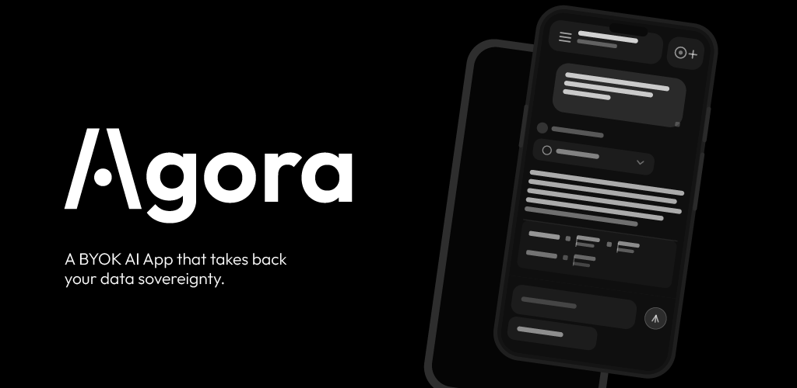
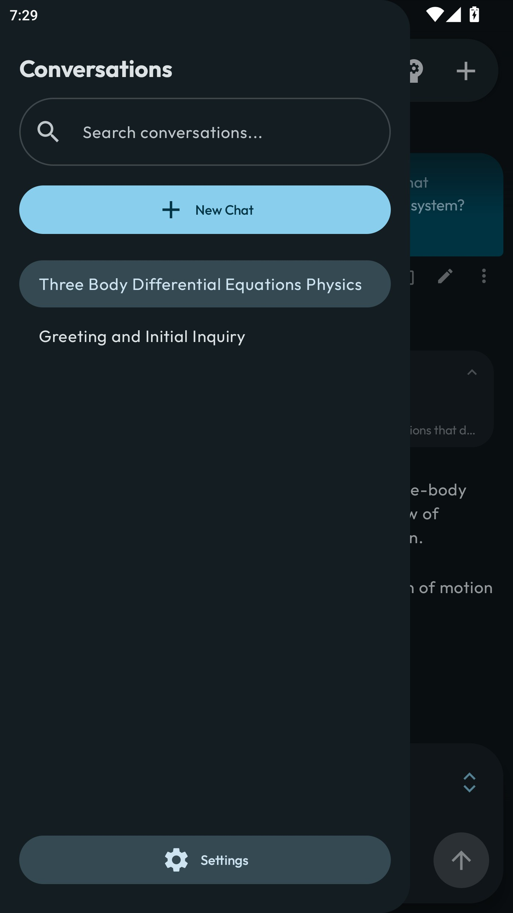
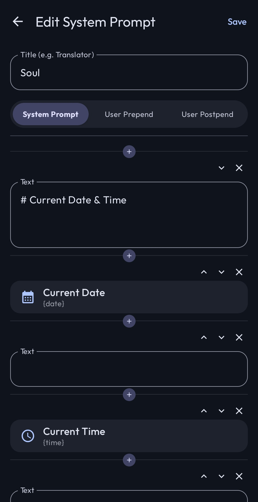

  

  # Agora

  **BYOK LLM 客户端：多提供商接入、智能代理工作流与远程设备控制**

  
  
  
   [English](README.md) | **中文**

  

## 下载

&nbsp;&nbsp;

&nbsp;&nbsp;

Agora 是开源 Android 客户端，用于接入你自己的模型账号与端点。它把对话保存在本地，模型请求由设备直接发送到所选提供商，并支持非线性消息分支、上下文 Compact、MCP、自动化、搜索、记忆、本地模型和远程 Shell 工具。

## 截图

<table>
<tr>
<td width="33%"></td>
<td width="33%"></td>
<td width="33%"></td>
</tr>
</table>

## 功能

- **九类内置提供商：** OpenAI、Anthropic、Google Gemini、DeepSeek、通义千问/DashScope、OpenRouter、Groq、Ollama 和本地 llama.cpp；自定义端点支持 OpenAI 兼容、Google 或 Anthropic 协议。
- **树形对话：** 编辑或重新生成历史消息时保留其他备选分支。
- **Token 预算上下文：** 4K–1M 估算预算；非破坏式 Compact 胶囊保留最近消息原文。
- **代理工具：** 网络搜索、记忆、历史对话 RAG、图片生成、MCP、任务/循环、远程 Shell 与文件、持久 Conch 任务，以及 F-Droid Alpine 沙盒。
- **本地智能：** 通过 llama.cpp 运行 GGUF 聊天模型和本地嵌入。
- **数据迁移：** 带版本的 `.agora` ZIP、ChatGPT/Claude 导入与定时备份。
- **个性化界面：** Material 3 主题、字体、触觉、思考/工具展示，以及系统默认加 12 种明确界面语言。

Conch 只有在配置 API Key 时启用应用层加密；空 Key 端点发送明文 JSON，应使用 HTTPS。外部提供商和工具只在你使用相应功能时接收所需数据，完整边界见隐私文档。

## 文档

- 📖 **[用户手册](https://newo-ether.github.io/Agora/zh/)** — 28 个维护页面，涵盖安装、提供商、上下文 Compact、MCP、自动化、工具、隐私与数据管理。
- 🏗️ **[架构指南](ARCHITECTURE.md)** — 当前运行时、持久化、提供商、工具与数据流。
- 🧰 **[开发文档](development-docs/documentation-maintenance.md)** — 内部需求、架构基线和文档维护规范。

公开手册位于 `docs/<locale>/`；内部工程文档单独位于 `development-docs/`。

## 快速开始

1. 安装 Agora，从对话抽屉进入**设置**。
2. 在**提供商**中添加凭据。
3. 在**模型**中同步并启用模型。
4. 从聊天底栏选择模型并发送消息。

详见[快速开始手册](https://newo-ether.github.io/Agora/zh/getting-started/)。

### 从源码构建

当前项目目标为 Android SDK 36，仓库工作流使用 JDK 21。请安装 Android Studio 及所需 SDK/NDK 组件，并遵循根目录项目脚本和说明。

## 技术栈

Kotlin、Jetpack Compose Material 3、Coroutines/Flow、Room、DataStore、OkHttp/SSE、`kotlinx.serialization`、Android NDK/CMake、llama.cpp、Coil，以及 Markdown/LaTeX 渲染。

## 隐私

Agora 不转发聊天补全，也没有通用分析。对话保存在应用管理的本地存储中；使用功能时，设备会直接访问已配置的提供商和工具。可选更新检查与主动提交评分有明确记录的网络目的地。崩溃后只在本地保留一份报告，并仅在用户下次启动明确确认后发送；报告包含诊断信息，不含对话文本或凭据。机密设置通常使用 Android Keystore AES-GCM 封装，但旧值以及加密失败时的保数据回退可能仍以明文存在 DataStore；若导出时选择机密，它们在 `.agora` 归档内部也不加密。

请阅读[隐私与安全](https://newo-ether.github.io/Agora/zh/privacy/)与仓库[隐私政策](PRIVACY.md)。

## 参与贡献与许可

欢迎通过 Issue 和 Pull Request 参与贡献。Agora 基于 [MIT License](LICENSE) 发布。
